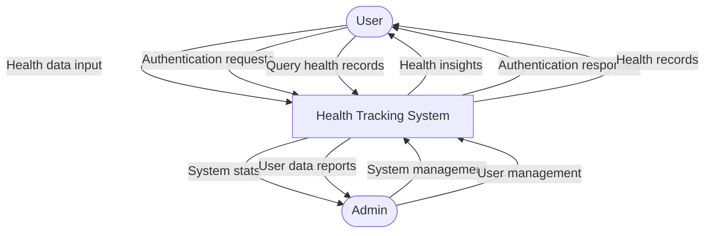
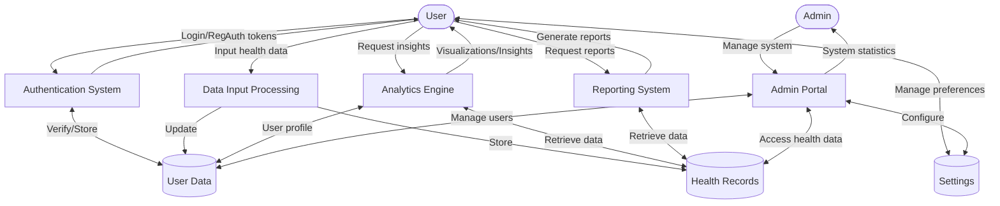
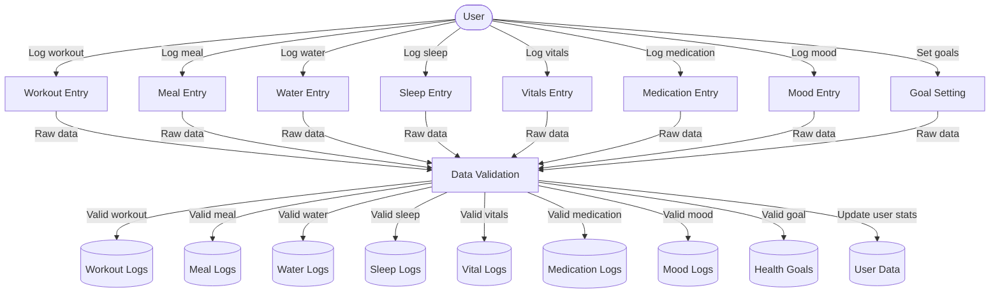
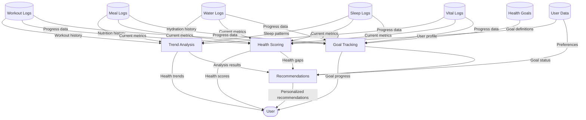
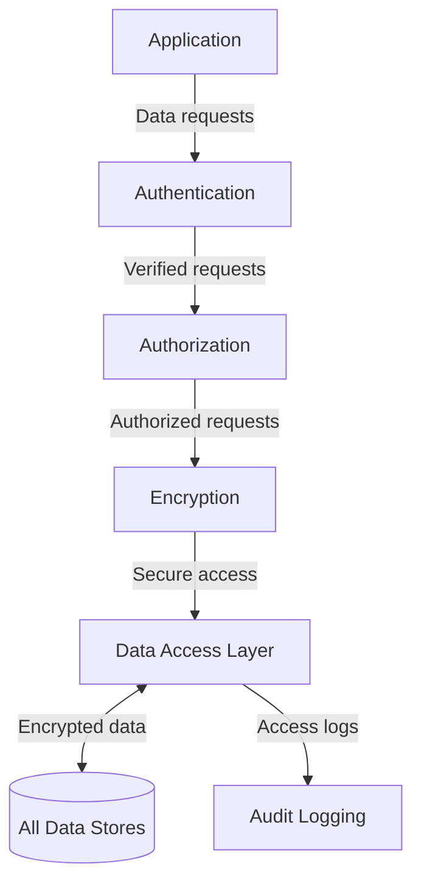

# Health Application Data Flow Diagram

This document presents the Data Flow Diagrams (DFDs) for our health tracking application, illustrating how data moves through the system.

## Level 0 DFD (Context Diagram)

## Level 1 DFD

## Level 2 DFD: Data Input Processing

## Level 2 DFD: Analytics Engine

## Data Security Layer

## Process Descriptions

### Authentication System
- Handles user registration and login
- Issues and validates authentication tokens
- Manages password reset functionality
- Stores user credentials securely

### Data Input Processing
- Accepts and validates health data from users
- Performs data sanitization and integrity checks
- Routes data to appropriate storage
- Updates user statistics based on new data

### Analytics Engine
- Analyzes health data to identify trends
- Calculates health scores based on multiple metrics
- Tracks progress toward user-defined goals
- Generates personalized recommendations

### Reporting System
- Generates daily, weekly, and monthly health reports
- Creates visualizations of health data
- Provides downloadable/shareable health summaries
- Customizes reports based on user preferences

### Admin Portal
- Provides system-wide statistics and monitoring
- Facilitates user account management
- Allows configuration of system settings
- Enables data export and backup functionality

## Data Stores

### User Data
Stores user profile information, authentication details, and aggregate health statistics.

### Health Records
Stores the various health logs (workouts, meals, water, sleep, etc.) with timestamps and user associations.

### Settings
Stores user preferences and system configuration settings.
