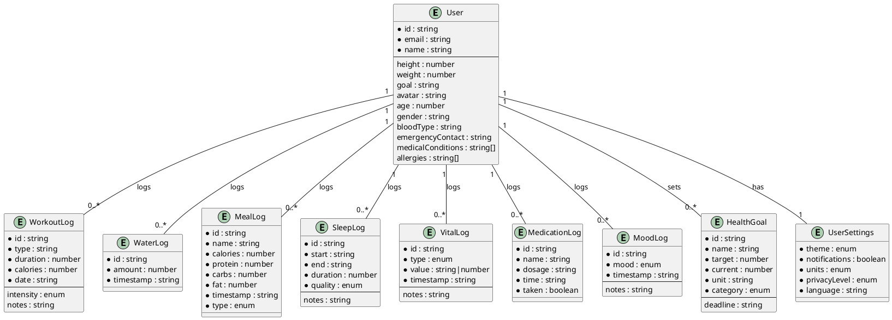
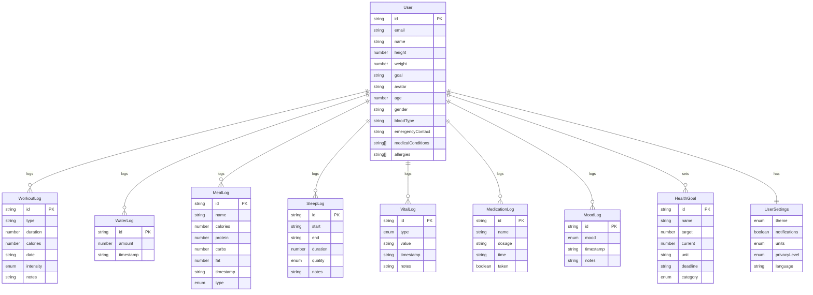

# Health Application ER Diagram

This diagram shows the relationships between entities in our health tracking application.

## PlantUML Notation

## Mermaid Notation

## Entity Descriptions

### User
The central entity that represents a user of the application. This includes basic profile information as well as health-related attributes.

### WorkoutLog
Records of workout sessions performed by the user, including type, duration, and calories burned.

### WaterLog
Tracks water intake by amount and timestamp.

### MealLog
Stores information about meals consumed, including nutritional information.

### SleepLog
Records sleep sessions with start and end times, duration, and quality rating.

### VitalLog
Stores vital sign measurements like blood pressure, heart rate, etc.

### MedicationLog
Tracks medications, dosages, and whether they were taken.

### MoodLog
Records the user's mood at various points in time.

### HealthGoal
Represents health-related goals set by the user, with target and current values.

### UserSettings
Stores user preferences for the application.

## Relationships

- A User can have multiple WorkoutLogs, WaterLogs, MealLogs, SleepLogs, VitalLogs, MedicationLogs, MoodLogs, and HealthGoals.
- A User has exactly one UserSettings record.
- All logs and goals belong to exactly one User.
